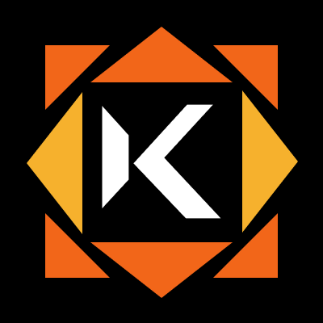
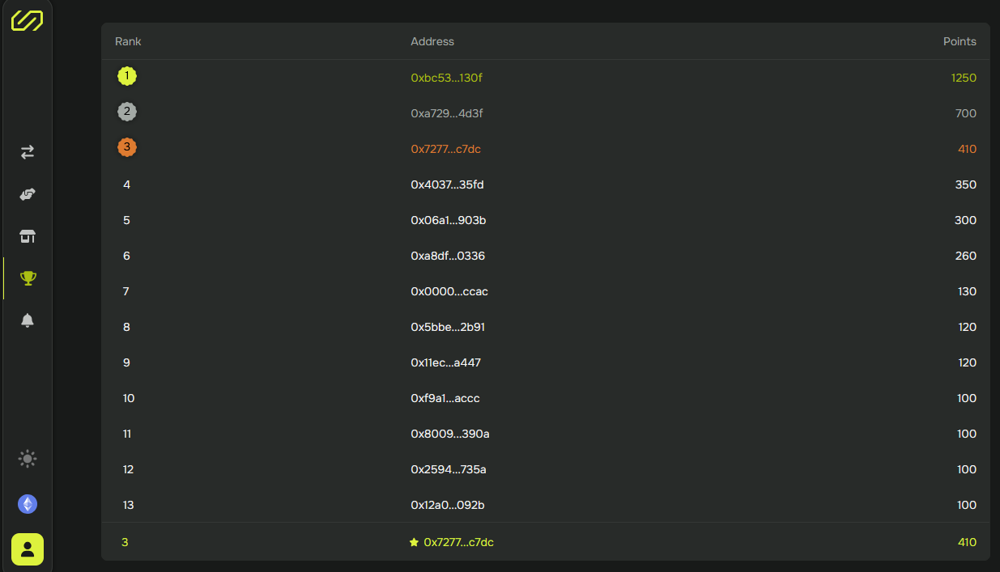

# Overview

> **Swaps, Marketplace and Leaderboard**

### Feeless swaps&#x20;

Swaplace is a cutting-edge protocol that allows you to swap assets like ERC20, ERC721, and ERC1155 tokens with any user, all without transaction fees on EVM-compatible networks!

<table data-view="cards"><thead><tr><th>Network</th><th></th></tr></thead><tbody><tr><td> <strong><code>Sepolia</code></strong></td><td>                    ✅</td></tr><tr><td><strong><code>Kakarot</code></strong></td><td>                    ✅</td></tr><tr><td> <strong><code>Optmism Sepolia</code></strong></td><td>                    ✅</td></tr><tr><td> <strong><code>Amoy</code></strong></td><td>                    ✅</td></tr><tr><td> <strong><code>Fuji</code></strong></td><td>                    ✅</td></tr><tr><td><strong><code>Bnb Tesnet</code></strong></td><td>                    ✅</td></tr><tr><td><strong><code>Arbitrum Sepolia</code></strong></td><td>                    ✅</td></tr><tr><td> <strong><code>Base Sepolia</code></strong></td><td>                    ✅</td></tr></tbody></table>

### [Swap](../developers/guides/preparing/make-swap.md)

* **Select and Bid**: Choose the asset you want from any address and make an offer by bidding your own assets in exchange.
* **Seamless Transactions**: Enjoy feeless swaps, making your trading experience smooth and cost-effective.

### [Marketplace](marketplace.md)

* **Public Offers**: Make your offers public so anyone can see and accept them.
* **Wide Reach**: Increase your chances of successful trades by exposing your offers to a broader audience.

### Leaderboard

* **Competitive Edge**: Climb the leaderboard by actively trading.
* **Earn Rewards**: The more you trade, the higher you rank, increasing your chances of earning juicy rewards!

<figure><figcaption></figcaption></figure>

